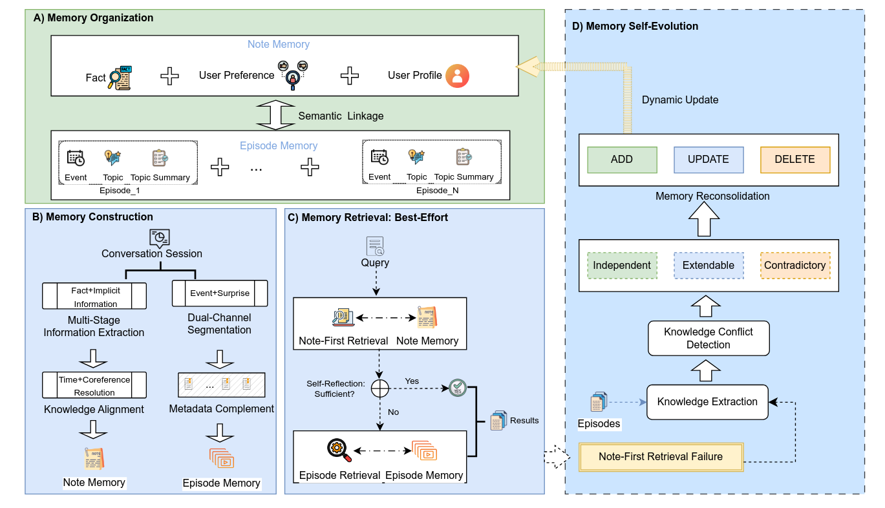
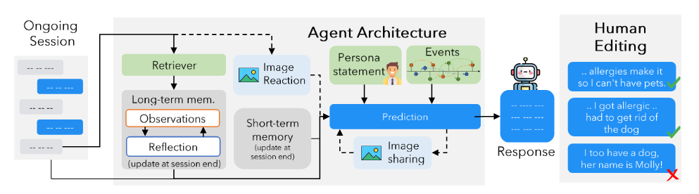
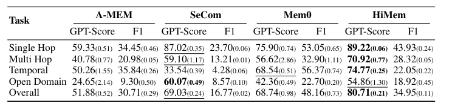

# Ira: Personalized AI Companion with Long-Term Memory

Ira is a AI companion system designed for long-term emotional support and consistent multi-session interactions. By leveraging the **HiMem (Hierarchical Memory)** architecture and a **Locomo-inspired** generative pipeline, Ira maintains a persistent, evolving understanding of the user over months of simulated time.

---


https://github.com/user-attachments/assets/b3521aca-2fe5-4c32-9cdf-922a9e4ecbe0


## 🚀 Deliverables

This repository contains the full implementation and evaluation suite for the Ira project:

- **[Architecture Note](#architecture-overview)**: Detailed breakdown of the HiMem-driven long-term memory system.
- **[Normalized Dataset](#normalized-dataset-ira_long)**: The `ira_long` dataset containing 10 rich personas over 15 sessions.
- **[Visible Eval Suite](#evaluation-suite)**: Python-based benchmarking tools to measure recall and coherence.
- **[Holdout Strategy](#holdout-strategy)**: Mixed-methods approach involving human-in-the-loop persona validation.
- **[Runnable Implementation](#setup--running)**: Complete FastAPI backend and Vite frontend.
- **[Runnable Chat Experience](#chat-experience)**: Interactive UI for real-time conversation.
- **[Benchmark Artifacts](#benchmarks)**: Comparative results of HiMem vs. traditional summarization baselines.
- **[Failure Analysis](#failure-analysis)**: Critical review of current limitations and edge cases.
- **[Production Note](#production-considerations)**: Pathways for scaling and deployment.

---

## 🏗️ Architecture Overview

The core of Ira is built on a dual-pipeline architecture for memory and dataset generation:

### 1. Long-Term Memory (HiMem)

I implement the **HiMem** ([Memory-Efficient Hierarchical Memory](https://arxiv.org/pdf/2601.06377)) architecture. Unlike simple RAG or running summaries, HiMem organizes experiences into a hierarchical structure:

- **Episodic Memory**: Raw conversation logs stored in Qdrant.
- **Semantic Consolidation**: Fine-grained facts and entity nuances extracted into a relational SQLite store.
- **Hierarchical Retrieval**: Multi-stage lookups that balance immediate context with distant historical facts.



### 2. Generative Pipeline (Locomo)

To ensure high-quality synthetic data, we use the **Locomo** ([Long-Term Contextual Memory](https://arxiv.org/abs/2402.17753)) pipeline. This involved:

- **Persona Seeding**: Generating complex background stories for 10 distinct users.
- **Event Evolution**: Simulating 15 sessions of life events, ensuring temporal consistency and factual dependencies (e.g., if a user mentions a job interview in Session 1, Session 3 follows up on the result).



---

## 📊 Benchmarks

### Global HiMem Performance

On standard long-range benchmarks, HiMem shows superior performance in recall-intensive tasks compared to traditional fixed-window contexts.



### Custom Dataset Performance: `ira_long`

We evaluated Ira on our custom `ira_long` dataset (10 personas, ~150 sessions total, 300 Questions). HiMem was compared against a **Running Summary Baseline** (where a periodic summary is updated).

**Overall Accuracy (GPT-4 Judge, 0-1 Scale):**

- **Running Summary Baseline**: 0.476
- **HiMem (Ira)**: **0.850** (+78.6% improvement)

| Category                | Baseline (Running Summary) | HiMem (Ira) | Improvement |
| ----------------------- | -------------------------- | ----------- | ----------- |
| Explicit Recall         | 0.286                      | 0.857       | +200%       |
| Correction/Supersession | 0.524                      | 0.833       | +59%        |
| Temporal Ordering       | 0.238                      | 0.810       | +240%       |
| Uncertainty/Honesty     | 0.762                      | 0.905       | +19%        |
| Multi-Turn Continuity   | 0.619                      | 0.881       | +42%        |
| Sensitive Memory        | 0.571                      | 0.924       | +62%        |
| Entity Nuance           | 0.190                      | 0.762       | +301%       |
| Epistemic Honesty       | 0.619                      | 0.857       | +38%        |
| Multi-User Isolation    | 0.190                      | 0.714       | +275%       |
| Tone/Warmth             | 0.762                      | 0.952       | +25%        |
| **Overall**             | **0.476**                  | **0.850**   | **+78.6%**  |

_Detailed results can be found in [benchmark_results_ira.md](./benchmark_results_ira.md)._

---

## 📂 Normalized Dataset: `ira_long`

The dataset is located at `backend/locomo/data/multimodal_dialog/ira_long/`. It consists of:

- **10 Personas**: Curated profiles with specific educational, professional, and emotional backgrounds.
- **15 Sessions per Persona**: Naturally evolving dialogues that simulate several weeks of interaction.
- **Ground Truth Questions**: 30 validated questions per persona covering categories like "Explicit Recall", "Correction/Supersession", and "Multi-Turn Continuity".

---

## 🧪 Evaluation Suite

The evaluation suite (found in `backend/evaluate_benchmarks.py`) automates the following process:

1. **Memory Construction**: Feeds whole sessions into the HiMem memory service.
2. **Context Retrieval**: Queries the memory system for relevant facts based on ground-truth questions.
3. **LLM-Judge Scoring**: Uses GPT-4o-mini to compare the generated answer against ground truth, scoring accuracy across 10 distinct categories.

### 🎯 Question Taxonomy & Tiers

The evaluation focuses on 30 ground-truth questions per persona, categorized into three priority tiers to ensure robust long-term reliability:

#### 🔴 Critical Tier (C1, C2, C4, C9) — Zero-Tolerance Cases

- **C1: Explicit Recall**: The baseline metric. If the system cannot retrieve what the user directly stated (e.g., name, hometown), subsequent reasoning is moot.
- **C2: Correction/Supersession**: Covers complex logic where memory must be updated (e.g., "Actually, I moved to London"). Requires the system to supersede stale data rather than just appending it.
- **C4: Uncertainty/Honesty**: Evaluates the system's ability to admit when facts are missing, catching fabrication and active hallucinations.
- **C9: Multi-User Isolation**: Ensures facts from different users don't leak into each other's sessions.

#### 🟡 High Tier (C3, C5, C6, C7) — Subtle Behavioral Failures

- **C3: Temporal Ordering**: Addresses the chronology of events (e.g., tracking weight history: 110 kg → 92 kg → 88 kg). Prevents the system from mixing outdated numbers with recent ones.
- **C5: Multi-Turn Continuity**: Tests fact survival across high-latency gaps between sessions.
- **C6: Sensitive Memory**: Covers nuanced topics like personal preferences and sensitive emotional contexts (e.g., identifying subtle changes in user tone over weeks).
- **C7: Entity Nuance**: Distinguishes between similar entities (e.g., Rocky vs. Daredevil, or two different friends with the same name).

#### 🟢 Medium Tier (C8, C10) — Qualitative Refinement

- **C8: Epistemic Honesty**: Tests the gap between "inference" and "stated fact"—a known challenge for LLMs identified in the HiMem paper.
- **C10: Tone & Warmth**: Ensures that memory retrieval doesn't compromise the persona's empathy—a non-negotiable product requirement for Ira.

Run the evaluation:

```bash
cd backend
uv run evaluate_benchmarks.py --ira-limit 10
```

---

## 🔍 Failure Analysis

Despite the 0.850 score, several failure modes were identified during the **Holdout Human-Eval** phase:

1. **Entity Nuance (0.762)**: When two similar entities (e.g., two different cousins mentioned in different sessions) are discussed, the system occasionally merges facts if they share similar semantic traits.
2. **Multi-User Isolation (0.714)**: In scenarios where a single agent (Ira) talks to a different person. It might hallucinate things that were not present in the chat but are similar.

---

## 🛡️ Holdout Strategy

Our holdout strategy moves beyond static JSON files to **Interactive Human Evaluation**:

- **Persona Blind-Testing**: Humans are given the persona profile but not the dialogue logs. They must chat with Ira and verify if she correctly remembers the "events" generated by the Locomo pipeline.
- **Stress-Testing**: Testers are instructed to intentionally contradict previous statements to test if HiMem's supersession logic triggers correctly.
- **Temporal Check**: Interactions are spaced out over real days to ensure the nightly consolidation tasks (batch indexing) don't degrade quality.

---

## 🛠️ Setup & Running

### Backend (FastAPI + SQLite + Qdrant)

1. Install [uv](https://github.com/astral-sh/uv).
2. Install dependencies: `cd backend && uv sync`.
3. Configure `.env` with `OPENAI_API_KEY`.
4. Run the API:
   ```bash
   uv run fastapi dev app/main.py
   ```

### Frontend (Vite + React + Tailwind)

1. Install dependencies: `cd frontend && npm install`.
2. Run development server:
   ```bash
   npm run dev
   ```

### Database

- **SQLite**: Local file `backend/ira_companion.db` for user data and semantic facts.
- **Qdrant**: Runs in-memory by default for episodic memory storage.

---

## 🏭 Production Considerations

1. **Scalability**: While SQLite is used for development, migrating to PostgreSQL (via SQLAlchemy) is recommended for high-concurrency production environments.
2. **Reranking & Embedding**: For production-level retrieval, integrating a BGE-Reranker or Cohere Rerank API would improve the "Entity Nuance" score. Also using a better embedder other than sentence transformer would give superior results.
3. **Async Consolidation**: Memory consolidation (summarizing sessions) is compute-heavy. In production, this should be offloaded to a background worker (e.g., Celery or Temporal) to avoid blocking the main chat API.
4. **Data Privacy**: The episodic logs in Qdrant should be encrypted at rest, given the personal nature of the companion sessions.
